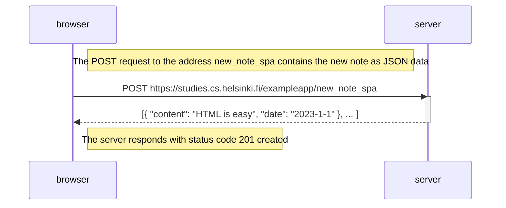

```mermaid
sequenceDiagram
    participant browser
    participant server

    Note right of browser: The POST request to the address new_note_spa contains the new note as JSON data

    browser->>server: POST https://studies.cs.helsinki.fi/exampleapp/new_note_spa
    activate server
    server-->>browser: [{ "content": "HTML is easy", "date": "2023-1-1" }, ... ]
    deactivate server

    Note right of browser: The server responds with status code 201 created
```
